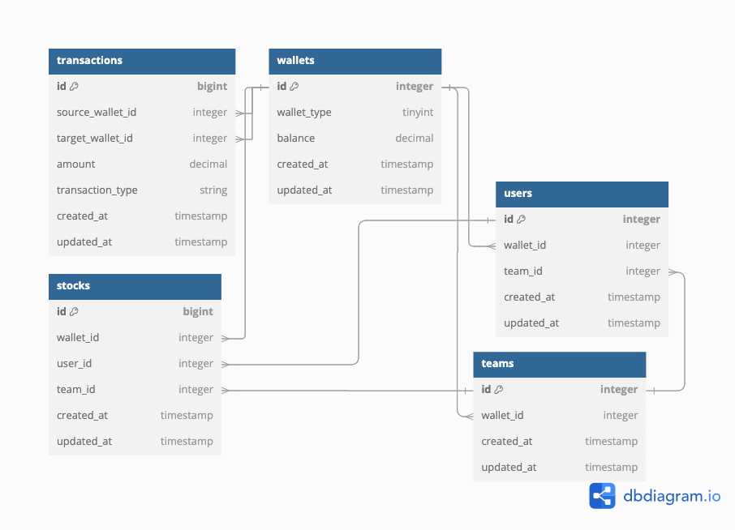

# Internal Wallet Transaction System

## Ruby on Rails (RoR)
## API Test

## How the Applications Work

The web-application is based on Rails Ruby Framework. It's implemented through Ruby on Rails Representational State Transfer Application Program Interface (REST-API). The assumptions that has been made are as follows:



1. Balance / amount is stored as decimal with up to 2 digit precision.
2. Most of the variable is styled in snake case.
3. Data created and updated date format in standard timestamp.
4. Every deposit (credit) and withdraw (debit) will also immediately change the wallet balance based on the amount in transaction beside can also be calculated from summing the transactions table.
5. Each of the user will have maximum of a single team.
6. Each of the stock will have it's user or team ot manage (can be more than one and will more prioritise team than user).  
7. Every deposit transaction will add the target wallet and deduct the source. 
8. Every withdraw transaction will deduct the target wallet and add the source. 
9. If source wallet is not existed yet, it will create the new one during deposit transaction. 
10. If target wallet is not existed yet, it will create the new one during the withdraw transaction. 

More detailed information can be found [here](RoR%20Test%20.pdf).

Design Decision:
* Execute rails new myapp.
* Execute rails generate migration CreateUsers.
* Execute rails generate migration CreateTeams.
* Execute rails generate migration CreateStocks.
* Execute rails generate migration CreateWallets.
* Execute rails generate migration CreateTransactions.
* Create app/models for validation the models.
* Create config/routes.rb for routing the APIs.
* Create app/controllers/authentication_controller.rb for authenticate the users.
* Create app/controllers/transaction_controller.rb for execute the transaction.
* Create env/ for operating system environment variable
* Create spec/ for unit-testing.
* Create app/services for better processing the data.
* Create lib/latest_stock_price.rb for get the latest external stock data.
* Create app/controllers/investation_controller.rb for calling the 3rd party API.
* Create README.md
* Refactor better variable name and finishing.  

## Getting Started (How to Run the Program)

These instructions will get you a copy of the project up and running on your local machine for development and testing purposes.

### Prerequisites (How to set up your machine)

1. Navigate to the directory where you've cloned this repo and setting up the docker first.
2. Still in the directory where you've cloned this repo, install all its dependencies and run the app.

    ```bash
    rails server
    ```

    Dependencies are all listed in `Dockerfile`.

3. The app is now running! To check that the web is actually running,
try to send a GET request to it, for instance:

    ```bash
    curl http://127.0.0.1:3000
    ```

    or open `http://localhost:3000` from your browser.

### Installing (How to check and test the program)

1. Make sure you already pull the docker images and run the container.
Both are listed in `Dockerfile` so if you followed the instructions to setup your machine above then they should already be installed and running.
2. You can run the check for running container ID with `docker ps` and for the installed images with `docker images` respectively.
3. To run the Structured Query Language Lite (SQlite) console in one command, you can use `sqlite3`. This is useful to check the database directly.
4. For more info on what you can do with `docker`, run `docker --help`.

## Documentation

### Authentication

* [Sign In](#sign-in)
* [Sign Out](#sign-out)

### Transaction

* [Deposit](#deposit)
* [Withdraw](#withdraw)

### Investation

* [Price](#price)
* [Prices](#prices)
* [Price All](#price-all)


## Sign In
URL: POST - `http://localhost:3000/sign_in`

Example Request Header:

```json
{
    "user_id": 1
}
```

## Sign Out
URL: POST - `http://localhost:3000/sign_out`

## Deposit
URL: POST - `http://localhost:3000/deposit`

Example Request Body:

```json
{
    "wallet": {
        "id": 1,
        "wallet_type": 2,
        "balance": 3
    }
}
```

## Withdraw
URL: POST - `http://localhost:3000/withdraw/`

Example Request Body:

```json
{
    "wallet": {
        "id": 1,
        "wallet_type": 2,
        "balance": 3
    }
}
```

## Price
URL: GET - `http://localhost:3000/price`

Example Response Body:

```json
{
    "identifier": "NIFTY 50",
    "change": 27.25,
    "dayHigh": 25445.7,
    "dayLow": 25336.2,
    "lastPrice": 25383.75,
    "lastUpdateTime": "16-Sep-2024 16:00:00",
    "meta": {
        "companyName": null,
        "industry": null,
        "isin": null
    },
    "open": 25406.65,
    "pChange": 0.11,
    "perChange30d": 2.1,
    "perChange365d": 29.85,
    "previousClose": 25356.5,
    "symbol": "NIFTY 50",
    "totalTradedValue": 187049240982.16,
    "totalTradedVolume": 168694880,
    "yearHigh": 25445.7,
    "yearLow": 18837.85
}
```

## Prices
URL: GET - `http://localhost:3000/prices?page=0&per_page=2`

Example Response Body:

```json
[
    {
        "identifier": "NIFTY 50",
        "change": 27.25,
        "dayHigh": 25445.7,
        "dayLow": 25336.2,
        "lastPrice": 25383.75,
        "lastUpdateTime": "16-Sep-2024 16:00:00",
        "meta": {
            "companyName": null,
            "industry": null,
            "isin": null
        },
        "open": 25406.65,
        "pChange": 0.11,
        "perChange30d": 2.1,
        "perChange365d": 29.85,
        "previousClose": 25356.5,
        "symbol": "NIFTY 50",
        "totalTradedValue": 187049240982.16,
        "totalTradedVolume": 168694880,
        "yearHigh": 25445.7,
        "yearLow": 18837.85
    },
    {
        "identifier": "BAJFINANCEEQN",
        "change": -256.5,
        "dayHigh": 7680,
        "dayLow": 7322,
        "lastPrice": 7342,
        "lastUpdateTime": "16-Sep-2024 15:59:47",
        "meta": {
            "companyName": "Bajaj Finance Limited",
            "industry": "Non Banking Financial Company (NBFC)",
            "isin": "INE296A13011"
        },
        "open": 7680,
        "pChange": -3.38,
        "perChange30d": 7.07,
        "perChange365d": -1.65,
        "previousClose": 7598.5,
        "symbol": "BAJFINANCE",
        "totalTradedValue": 19973322583.350002,
        "totalTradedVolume": 2679555,
        "yearHigh": 8192,
        "yearLow": 6187.8
    }
]
```


## Price All
URL: GET - `http://localhost:3000/price_all`

Postman's API Documentation can be found [here](Rapid.postman_collection.json).

## Built With

* [Rails](https://rubyonrails.org/) - The web framework used in backend development language (Ruby)
* [SQLite](https://www.sqlite.org/) - Used to generate database

## Authors

* **Bryanza Novirahman** - *Software Engineer with approximately 5 years of experience* - [LinkedIn](https://www.linkedin.com/in/bryanza-novirahman-902a94131)

## Important links
* [Docker](https://www.docker.com)